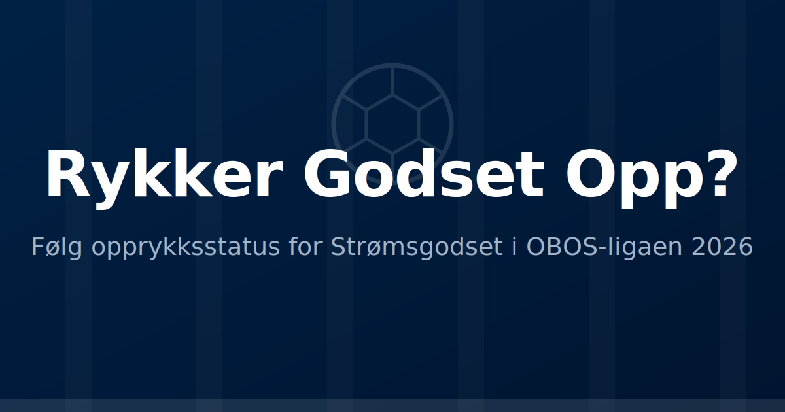

# Rykker Godset Opp?



> Live-oppdatering av Strømsgodsets vei tilbake til Eliteserien.

**Se siden live: https://godset.mats.codes**

En enkel, statisk nettside som viser nøkkeltall og tabellstatus for
Strømsgodset i OBOS-ligaen 2026. Data hentes fra NIFS API og oppdateres
automatisk hver dag.

Denne siden er ikke offisiell og har ingen tilknytning til Strømsgodset, OBOS-ligaen eller andre. Kun laget med ekte kjærlighet for laget mitt :blue_heart:

## Utvikling

### Kom i gang

Krever [mise](https://mise.jdx.dev/) og [uv](https://docs.astral.sh/uv/):

```bash
mise install      # Installerer Python og uv
uv sync           # Installerer avhengigheter
```

### Makefile-kommandoer

Prosjektet bruker en `Makefile` for alle vanlige oppgaver:

| Kommando | Beskrivelse |
|----------|-------------|
| `make fetch` | Henter nyeste data fra NIFS API |
| `make stats` | Beregner statistikker fra rådata |
| `make build` | Bygger statisk nettside |
| `make all` | Kjører hele pipelinen: fetch → stats → build |
| `make serve` | Starter lokal server på [http://localhost:8000](http://localhost:8000) |
| `make clean` | Sletter genererte filer |
| `make ci` | Full pipeline med verifisering (brukes av GitHub Actions) |
| `make help` | Viser alle tilgjengelige kommandoer |

### Vanlige arbeidsflyter

**Bygg og forhåndsvis lokalt:**

```bash
make all     # Hent data, beregn stats, bygg site
make serve   # Åpne http://localhost:8000 i nettleseren
```

**Kun oppdatere data:**

```bash
make fetch
make stats
make build
```

**Rydde og starte på nytt:**

```bash
make clean
make all
```

## Hvordan fungerer det?

Se [AGENTS](./AGENTS.md).

## Datakilde

[NIFS - Norsk Internasjonal Fotballstatistikk](https://www.nifs.no) sitt [API](https://api.nifs.no/).

## CI/CD

[GitHub Actions](./.github/workflows/update-site.yml) kjører `make ci` (fetch → stats → build + verifisering) hver
time og ved manuell trigging. Siden publiseres til GitHub Pages.

## Lisens

[MIT](./LICENSE)
